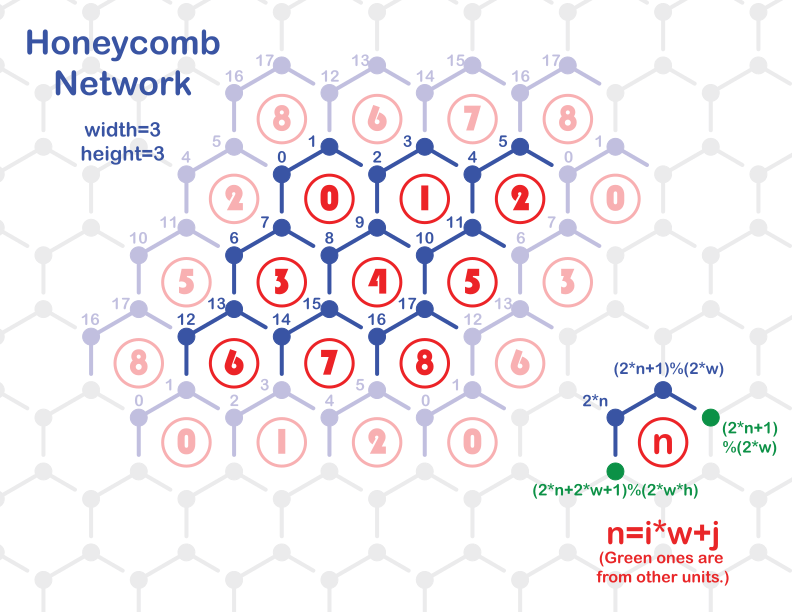

# CimNet - C++复杂网络工具包

_作者：胡鑫涛_

_版本号：0.1.1_

- [`CimNet`简介](#cimnet简介)
- [安装`CimNet`](#安装cimnet)
- [`CimNet`使用说明](#cimnet使用说明)
  - [文件结构](#文件结构)
  - [关于随机数](#关于随机数)
  - [使用网络](#使用网络)
    - [1. 创建网络](#1-创建网络)
    - [2. 编辑网络结构](#2-编辑网络结构)
    - [3. 存储节点/边数据](#3-存储节点边数据)
    - [4. 网络拷贝和转换](#4-网络拷贝和转换)
    - [5. 网络数据和遍历](#5-网络数据和遍历)
    - [6. 已实现的网络结构](#6-已实现的网络结构)
- [`CimNet`接口说明](#cimnet接口说明)
  - [基本数据类型](#基本数据类型)
  - [网络异常类](#网络异常类)
    - [通用网络异常](#通用网络异常)
    - [缺失节点异常](#缺失节点异常)
    - [缺失边异常](#缺失边异常)
  - [通用无向网络类`Network`](#通用无向网络类network)
  - [通用有向网络类`DirectedNetwork`](#通用有向网络类directednetwork)
  - [已实现的常用网络](#已实现的常用网络)
    - [FullConnectedNetwork - 全连接网络](#fullconnectednetwork---全连接网络)
    - [RegularNetwork - 规则网络](#regularnetwork---规则网络)
    - [ERNetwork - ER随机图](#ernetwork---er随机图)
    - [GridNetwork - 格子网络](#gridnetwork---格子网络)
    - [CustomizableGridNetwork - 定制化格子网络](#customizablegridnetwork---定制化格子网络)
    - [CubicNetwork - 立方体网络](#cubicnetwork---立方体网络)
    - [HoneycombNetwork - 蜂窝网络](#honeycombnetwork---蜂窝网络)
    - [KagomeNetwork - Kagome晶格网络](#kagomenetwork---kagome晶格网络)
    - [ScaleFreeNetwork - 无标度网络](#scalefreenetwork---无标度网络)
- [关于C++语言](#关于c语言)
  - [面向对象](#面向对象)
  - [实例化与模板类](#实例化与模板类)
  - [对象的指针与引用](#对象的指针与引用)
  - [标准容器类的遍历](#标准容器类的遍历)
  - [继承](#继承)
- [项目贡献者](#项目贡献者)
- [漏洞报告](#漏洞报告)
- [开源协议](#开源协议)

## `CimNet`简介

`CimNet`是一个纯C\++实现的复杂网络库，它基于`C++11`标准的语法编写。

`CimNet`支持以下特性：

- 提供了十分易用的方式创建和编辑网络
- 支持在节点和边上存放自定义的数据类型
- 实现了几种模拟常用的网络结构
- 支持继承原始类以拓展你自己的网络结构

## 安装`CimNet`

`CimNet`最新版发布地址：[GitHub Releases](https://github.com/hxt-tg/cimnet/releases)

`CimNet`无需安装，按照下述步骤使用这个库：

1. 在上面的发布地址下载zip文件；
2. 解压zip文件，将其中的`cimnet`文件夹复制到你的工程文件夹下（或者你存放库的位置）；
3. 将你的工程目录加入编译环境的Include查询目录中。例如，如果你使用`g++`作为编译器，可以用下面的命令编译一个单独的源码文件`main.cc`。
```sh
g++ main.cc -o main.out -std=c++11 -O2 -I /path/to/your/project
```

## `CimNet`使用说明

如果你之前编写过C语言，但是从未接触过C\++语言，或者不了解`C++11`标准的新特性，可以跳转到章节“[关于C++语言](#关于c++语言)”了解快速上手`CimNet`的语言特性。

### 文件结构

`CimNet`工具包含于`cimnet`文件夹内，由以下文件组成：

| 文件                  | 内容概述             |
| --------------------- | -------------------- |
| `cimnet/_types.h`     | 基础数据类型         |
| `cimnet/_exception.h` | 网络异常类           |
| `cimnet/_base_net.h`  | 通用无向/有向网络类  |
| `cimnet/network.h`    | 已实现的常用网络结构 |
| `cimnet/random.h`     | MT随机数生成         |

一般情况下，你只需要引用`cimnet/network.h`这个头文件，就可以使用默认的基础数据类型、网络异常类和有向/无向通用网络类。已实现的常用网络结构全部继承于通用无向网络，网络的节点编号类型为整型。

如果你想使用优秀的随机数生成算法，可以引用`cimnet/random.h`，也可以使用标准库中的随机数函数。

### 关于随机数

`CimNet`使用了[Mersenne twister随机数生成算法](https://en.wikipedia.org/wiki/Mersenne_Twister)。这个算法是由Makoto Matsumoto（松本 眞）和Takuji Nishimura（西村 拓士）于1997年提出的。这个随机数算法运行速度快，产生的随机数分布均匀，适合用于对统计信息较为敏感的场合。

`cimnet/random.h`中的函数如下：

| 函数                        | 说明                              |
| --------------------------- | --------------------------------- |
| `sgenrand(unsigned long i)` | 将参数`i`设置为随机数种子         |
| `randi(unsigned long N)`    | 返回一个0 ~ N-1的随机整数         |
| `randf()`                   | 返回一个0~1的随机小数（double型） |

### 使用网络

#### 1. 创建网络

你可以用下面的语句创建一个不含任何点边的空的无向网络：
```cpp
Network<> net;
```

这个网络用`Id`类型作为节点编号的标识（见`CimNet`接口之[基本数据类型](#基本数据类型)）。每个节点的编号应该互不相同。创建一个空的有向网络：
```cpp
DirectedNetwork<> net;
```

你也可以指定自己节点类型：
```cpp
Network<std::string> net;
```

这样一来，在网络`net`中你可以使用标准库的字符串来唯一标识一个节点。

#### 2. 编辑网络结构

你可以向网络中添加节点：
```cpp
net.add_node(1);
```

网络中就增加了一个以`1`为编号的节点。如果你指定了节点编号类型为`std::string`，也可以用以下方式添加节点：
```cpp
net.add_node("A");
```

你可以使用`has_node(id)`方法判断网络中是否有以`id`为编号的节点，以上面的网络为例，下列语句：
```cpp
std::cout << net.has_node("A") << std::endl;
std::cout << net.has_node("Not existed") << std::endl;
```
会打印
```
true
false
```

两个节点间的连接关系称为边。向网络中添加一条边：
```cpp
net.add_edge(1, 2);
```
如果网络`net`为无向网络，可以使用`has_edge(id1, id2)`方法判断网络中是否存在边，`id1`和`id2`的位置可以调换。你也可以使用`is_neighbor(id1, id2)`判断网络中`id1`与`id2`是否为邻居节点，它的作用和`has_edge`是一样的。

如果网络`net`为有向网络，可以使用`has_successor(id1, id2)`判断节点`id1`是否存在后继节点`id2`，使用`has_predecessor(id1, id2)`判断节点`id1`是否存在前序节点`id2`。有向网络也有`has_edge`方法，它和`has_successor`方法是等效的。有向网络的`is_neighbor(id1, id2)`方法在`id1`和`id2`之间存在连边（无论是`id1`指向`id2`或`id2`指向`id1`）时返回`true`。如果有向网络`net`中存在一条以节点`1`指向节点`2`的边，下列表达式：
```cpp
net.has_successor(1, 2)
net.has_predecessor(2, 1)
net.has_edge(1, 2)
net.is_neighbor(1, 2)
net.is_neighbor(2, 1)
```
的值均为`true`。

#### 3. 存储节点/边数据

在存储数据前需要在模板类处指定存储的数据类型。我们定义如下两种类型：
```cpp
typedef std::string NodeDescribe;
typedef struct {
    int amount;
    double weight;
} EdgeDetail;
```
并且以这种方式声明网络，并添加一条边：
```cpp
Network<Id, NodeDescribe, EdgeDetail> net;
net.add_edge(1, 2);
```
网络中便有了两个点和一条边。接下来你可以这样在网络的节点中添加数据：
```cpp
net.node(1) = "First node";
net[2] = "Second node;
```
上面两个语句都能用来添加数据。第一条语句使用`node(id)`方法返回了节点`id`存储的引用，这使得你可以通过引用修改内部存储。网络类也提供了下标的方式返回节点引用（即第二条语句所示），这使得你可以更方便地存取网络节点的数据。在网络的边上添加数据也可以通过类似的方式：
```cpp
net.edge(1, 2) = {3, 3.14};
net(1, 2) = {3, 3.14};
```
同理，第一条语句使用调用函数的形式访问边数据的引用，第二条语句是一种更简便的方式——它重载了这个类的括号操作符。当然，由于`edge(id1, id2)`方法返回的是`EdgeDetail`结构体的引用，你可以使用`.`直接修改内部成员：
```cpp
net.edge(1, 2).amount = 4;
net(1, 2).amount = 4;
```
点数据和边数据都能存储其它任意的你定义过的类的对象，但是每个点之间或每条边之间存储的类型要一致。

在添加节点和边的方法里也可以直接添加数据：
```cpp
net.add_node(1, "First node");
net.add_node(2, "Second node");
net.add_edge(1, 2, {3, 3.14});
```

#### 4. 网络拷贝和转换

`CimNet`提供拷贝构造器完成网络的拷贝操作。你可以将一个网络及其内部数据完全复制给另一个网络，此后前一个网络的修改不影响拷贝后的网络数据。只需要将原始网络作为参数传入新网络的初始化参数列表中即可。
```cpp
Network<Id, NodeDescribe, EdgeDetail> net;
// Add nodes and edges to net
Network<Id, NodeDescribe, EdgeDetail> net_copy(net);
DirectedNetwork<Id, NodeDescribe, EdgeDetail> di_net_copy(net);
```
需要注意拷贝网络的模板参数需要保持一致，它的类既可以是`Network`也可以是`DirectedNetwork`。如果原网络是无向网络且新网络是有向网络，所有无向的连边会转化成两条有向且指向相反的连边。如果将有向网络拷贝为无向网络，所有的有向连边失去方向，变为无向连边。

#### 5. 网络数据和遍历

在无向网络中使用`degree(id)`方法可以获知节点`id`的度。

在有向网络中，`in_degree(id)`返回节点`id`的入度，`out_degree(id)`返回节点`id`的出度，`degree(id)`返回了入度和出度的和。

`number_of_nodes()`方法会返回网络的节点数量，`number_of_edges()`方法会返回网络边的数量。`total_degree()`方法会返回网络的总度数，它从数值上等于网络总边数的两倍。

你也可以直接使用`std::cout`输出流打印网络信息：
```cpp
std::cout << net << std::endl;
```
它会简要打印网络的节点数、边数和总度数信息。

调用`nodes()`方法可以获取网络中所有的节点编号（`std::vector<NodeId>`），`edges()`方法可以获取网络中所有的边，它是一个点对的集合容器（`std::unordered_set<std::pair<NodeId, NodeId>>`）。`neighbors(id)`返回节点`id`的所有邻居（`std::vector<NodeId>`）。可以参考下面的方式遍历网络和邻居的节点编号：
```cpp
for (auto &node : net.nodes())
	// Visit node
for (auto &edge : net.edges())
	// Visit edge.first and edge.second
for (auto &neighbor : net.neighbors())
	// Visit neighbor
```
其中由于边`edge`是`std::pair<NodeId, NodeId>`类型，`C++11`中需要用`first`和`second`访问一条边中的两个节点编号。对于无向网络而言，`edge.first`是一条边中较小的一个节点编号（数值较小或字符串字母序靠前的）；有向网络中`edge.first`是前序节点，`edge.second`是后继节点。

（如果你支持`C++17`以上的编译，可以尝试将循环替换为`for (auto &[i, j] : net.edges())`，其中`i`和`j`等效于`edge.first`和`edge.second`。）

另外，对于无向网络而言，`neighbors(id)`返回了节点`id`所有相邻节点编号；对于有向网络而言，`neighbors(id)`返回了所有与节点`id`有关联（无论方向）的节点编号。有向网络还提供了`predecessors(id)`方法用来返回节点`id`的所有前序节点编号，`successors()`方法用来返回节点`id`的所有后继节点编号，它们的遍历方式与`neighbors(id)`类似。

#### 6. 已实现的网络结构

目前所有已实现的网络结构都是模板类，且节点编号都是`Id`类型的——所以模板只接受两个模板参数，`NodeData`和`EdgeData`，它们默认都是`None`。这些网络的用法和通用网络类型基本一致，只是初始化时需要传入指定的参数。这里给出一个较为完整的程序实例：构建一个包含10个节点的规则网络，这个网络的每个节点都和周围6个邻居连边（即，每个节点向顺时针方向的3个邻居添加连边）。最后我们打印网络信息和一号节点的邻居节点编号。
```cpp
#include "cimnet/network.h"

int main(void) {
    RegularNetwork<> net(10, 3);
    std::cout << net << std::endl;
    std::cout << "Neighbors of node 1: ";
    for (auto &n : net.neighbors(1))
        std::cout << n << " ";
    std::cout << std::endl;
    return 0;
}
```

这段代码的第1行引用了网络结构的头文件。主函数的第1行用模板类定义了规则网络`net`，主函数的第4行遍历了网络中1号节点的邻居，变量`n`的值为每次遍历到的一个邻居节点的编号。


## `CimNet`接口说明

### 基本数据类型

基本数据类型在`cimnet/_types.h`内定义，在引用`cimnet/network.h`后可以直接使用。建议使用以下更加表意的类型对你的变量定义。基本数据类型包含以下三种类型：

| 类型名   | 原始类型             | 说明                                 |
| -------- | -------------------- | ------------------------------------ |
| `Id`     | `unsigned int`       | 默认的节点编号类型                   |
| `Weight` | `double`             | 建议作为网络权重数据的类型           |
| `None`   | `class _NoneType {}` | 不存储任何数据的空类，标识"空"的概念 |

### 网络异常类

网络异常类在`cimnet/_exception.h`内定义，用于库中的异常抛出。

#### 通用网络异常
继承关系：`class NetworkException : public std::exception`

```cpp
NetworkException::NetworkException(const std::string &info);
```
构造网络异常的基类，将`info`作为网络异常的报错信息。支持的方法：

- `void set_info(const std::string &info)`：抛出前修改异常信息为`info`。

#### 缺失节点异常
继承关系：`class NoNodeException : public NetworkException`

```cpp
NoNodeException<NodeId>::
    NoNodeException(const NodeId &id);
```
模板参数默认为`Id`。构造缺失节点异常类时需要传入：

| 参数 | 说明           |
| ---- | -------------- |
| `id` | 缺失节点的编号 |

#### 缺失边异常
继承关系：`class NoEdgeException : public NetworkException`

```cpp
NoEdgeException<NodeId>::
    NoEdgeException(const NodeId &id1, const NodeId &id2, bool is_directed);
```
模板参数默认为`Id`。构造缺失边异常类时需要传入：

| 参数          | 说明                          |
| ------------- | ----------------------------- |
| `id1`         | 缺失边的第一个节点编号        |
| `id2`         | 缺失边的第二个节点编号        |
| `is_directed` | 是否为有向边（默认为`false`） |

### 通用无向网络类`Network`

通用无向网络类在`cimnet/_base_net.h`内定义，类的声明如下：
```cpp
template <class NodeId, class NodeData, class EdgeData> class Network;
```
其中模板参数默认分别为`Id`、`None`和`None`。`Network`包含以下三个构造器：

- `Network()`

    构造空的无向网络。

- `Network(const Network<NodeId, NodeData, EdgeData> &net)`

    构造无向网络`net`的无向拷贝。

- `Network(const DirectedNetwork<NodeId, NodeData, EdgeData> &net)`

    构造有向网络`net`的无向拷贝。所有的有向边会转换为无向边。

通用无向网络类中定义的方法如下：

- `friend std::ostream &operator<<(std::ostream &out, const Network &net)`

	支持网络信息通过输出流输出。对于空网络它会输出以下信息：
```
Network {#(node)=0, #(edge)=0, #(degree)=0}
```

- `NodeId add_node(const NodeId &id, const NodeData &node_data)`

	向网络中添加一个节点编号为`id`的节点，并将它的节点数据赋值为`node_data`。`node_data`如果没有给定，将使用`NodeData`类的默认构造器赋值。如果节点编号`id`已经在网络中，那么新的`node_data`会覆盖原有节点数据。

- `void add_edge(const NodeId &id1, const NodeId &id2, const EdgeData &edge_data)`

    向网络中添加一条节点`id1`与节点`id2`之间的连边，并将它的边数据赋值为`edge_data`。`edge_data`如果没有给定，将使用`EdgeData`类的默认构造器赋值。如果相应的边已经在网络中，那么新的`edge_data`会覆盖原有边数据。任一个节点如果不存在于网络中，会被自动添加，并使用默认`NodeData`构造器初始化值。

- `void remove_edge(const NodeId &id1, const NodeId &id2)`

    从网络中移除节点`id1`与节点`id2`之间的连边，相应边的边数据也会被清除。如果任一节点不存在，将会抛出`NoNodeException`异常。如果相应的连边不存在，将会抛出`NoEdgeException`异常。

- `void remove_node(const NodeId &id)`

    从网络中移除节点`id`，并移除所有与其相连的边，存储在上面的数据也会被清除。如果节点不存在，将会抛出`NoNodeException`异常。

- `bool has_node(const NodeId &id) const`

    如果网络中存在节点`id`，返回`true`，否则返回`false`。

- `bool has_edge(const NodeId &id1, const NodeId &id2) const`

    如果网络中存在节点`id1`与节点`id2`之间的连边，返回`true`；如果连边不存在，或其中任一节点不存在，返回`false`。

- `bool is_neighbor(const NodeId &id1, const NodeId &id2) const`

    等效于`has_edge`方法。

- `NodeData &node(const NodeId &id)`

    返回节点`id`的节点数据的引用以读写。如果节点不存在，将会抛出`NoNodeException`异常。

- `EdgeData &edge(const NodeId &id1, const NodeId &id2)`

    返回节点`id1`与节点`id2`间的连边的边数据的引用以读写。如果任一节点不存在，将会抛出`NoNodeException`异常。如果相应边不存在，将会抛出`NoEdgeException`异常。

- `EdgeData get_edge_data(const NodeId &id1, const NodeId &id2) const`

    返回节点`id1`与节点`id2`间的连边的边数据。与`edge`方法不同的是，这个边数据是内部存储的一份拷贝，修改这个变量不会影响网络内存储的边数据。其他特性同`edge`方法。

- `int number_of_nodes() const`

    返回网络中节点的总数。

- `int number_of_edges() const`

    返回网络中边的总数。

- `int total_degree() const`

    返回网络总度数，即各节点度之和。

- `int degree(const NodeId &id) const`

    返回节点`id`的度。如果节点不存在则返回`0`。

- `std::vector<NodeId> neighbors(const NodeId &id) const`

    返回与节点`id`相邻的节点的编号数组。如果该节点不存在，返回空数组。

- `std::vector<NodeId> nodes() const`

    返回网络中所有节点编号的数组。

- `std::unordered_set<NodeId> edges() const`

    返回网络中所有边的点对集合。集合中的每一项（设为变量`e`)都是一条边，使用`e.first`获取这条边较小的一个节点编号，使用`e.second`获取另一个节点编号。节点编号的大小比较依赖于具体编号类型的实现，例如`Id`类型取无符号整数较小的一个，`std::string`取字母序靠前的一个字符串等。

- `NodeData &operator[](const NodeId &id)`

    等效于`node`方法。


### 通用有向网络类`DirectedNetwork`

通用有向网络类在`cimnet/_base_net.h`内定义，类的声明如下：
```cpp
template <class NodeId, class NodeData, class EdgeData> class DirectedNetwork;
```
其中模板参数默认分别为`Id`、`None`和`None`。`DirectedNetwork`包含以下三个构造器：

- `DirectedNetwork()`

    构造空的有向网络。

- `DirectedNetwork(const DirectedNetwork<NodeId, NodeData, EdgeData> &net)`

    构造有向网络`net`的有向拷贝。

- `DirectedNetwork(const Network<NodeId, NodeData, EdgeData> &net)`

    构造无向网络`net`的有向拷贝。所有的无向边会转为两条方向相反的有向边。

通用有向网络类中定义的方法如下：

- `friend std::ostream &operator<<(std::ostream &out, const DirectedNetwork &net)`

	支持网络信息通过输出流输出。对于空网络它会输出以下信息：
```
DirectedNetwork {#(node)=0, #(edge)=0, #(degree)=0}
```

- `NodeId add_node(const NodeId &id, const NodeData &node_data)`

	向网络中添加一个节点编号为`id`的节点，并将它的节点数据赋值为`node_data`。`node_data`如果没有给定，将使用`NodeData`类的默认构造器赋值。如果节点编号`id`已经在网络中，那么新的`node_data`会覆盖原有节点数据。

- `void add_edge(const NodeId &id1, const NodeId &id2, const EdgeData &edge_data)`

    向网络中添加一条由节点`id1`指向节点`id2`的连边，并将它的边数据赋值为`edge_data`。`edge_data`如果没有给定，将使用`EdgeData`类的默认构造器赋值。如果相应的边已经在网络中，那么新的`edge_data`会覆盖原有边数据。任一个节点如果不存在于网络中，会被自动添加，并使用默认`NodeData`构造器初始化值。

- `void remove_edge(const NodeId &id1, const NodeId &id2)`

    从网络中移除由节点`id1`指向节点`id2`的连边，相应边的边数据也会被清除。如果任一节点不存在，将会抛出`NoNodeException`异常。如果相应方向的有向边不存在，将会抛出`NoEdgeException`异常。

- `void remove_node(const NodeId &id)`

    从网络中移除节点`id`，并移除所有与其前序节点和后继节点的连边，存储在上面的数据也会被清除。如果节点不存在，将会抛出`NoNodeException`异常。

- `bool has_node(const NodeId &id) const`

    如果网络中存在节点`id`，返回`true`，否则返回`false`。

- `bool has_successor(const NodeId &id1, const NodeId &id2) const`

    如果网络中节点`id1`存在一个后继节点`id2`，返回`true`；如果这个连边关系不存在，或其中任一节点不存在，返回`false`。

- `bool has_predecessor(const NodeId &id1, const NodeId &id2) const`

    如果网络中节点`id1`存在一个前序节点`id2`，返回`true`；如果这个连边关系不存在，或其中任一节点不存在，返回`false`。

- `bool has_edge(const NodeId &id1, const NodeId &id2) const`

    等效于`has_successor`方法。

- `bool is_neighbor(const NodeId &id1, const NodeId &id2) const`

    如果网络中节点`id1`是节点`id2`的前序或者后继节点，返回`true`；如果这两个点之间不存在任何连边关系，或其中任一节点不存在，返回`false`。

- `NodeData &node(const NodeId &id)`

    返回节点`id`的节点数据的引用以读写。如果节点不存在，将会抛出`NoNodeException`异常。

- `EdgeData &edge(const NodeId &id1, const NodeId &id2)`

    返回由节点`id1`指向节点`id2`的有向边上的边数据的引用以读写。如果任一节点不存在，将会抛出`NoNodeException`异常。如果相应边不存在，将会抛出`NoEdgeException`异常。

- `EdgeData get_edge_data(const NodeId &id1, const NodeId &id2) const`

    返回由节点`id1`指向节点`id2`的有向边上的边数据。与`edge`方法不同的是，这个边数据是内部存储的一份拷贝，修改这个变量不会影响网络内存储的边数据。其他特性同`edge`方法。

- `int number_of_nodes() const`

    返回网络中节点的总数。

- `int number_of_edges() const`

    返回网络中边的总数。

- `int total_degree() const`

    返回网络总度数，即各节点度之和。

- `int in_degree(const NodeId &id) const`

    返回节点`id`的入度。如果节点不存在则返回`0`。

- `int out_degree(const NodeId &id) const`

    返回节点`id`的出度。如果节点不存在则返回`0`。

- `int degree(const NodeId &id) const`

    返回节点`id`的度。如果节点不存在则返回`0`。

- `std::vector<NodeId> successors(const NodeId &id) const`

    返回节点`id`后继节点的编号数组。如果该节点不存在，返回空数组。

- `std::vector<NodeId> predecessors(const NodeId &id) const`

    返回节点`id`前序节点的编号数组。如果该节点不存在，返回空数组。

- `std::vector<NodeId> neighbors(const NodeId &id) const`

    返回与节点`id`存在连边关系的节点的编号数组（无论指向）。如果该节点不存在，返回空数组。

- `std::vector<NodeId> nodes() const`

    返回网络中所有节点编号的数组。

- `std::unordered_set<NodeId> edges() const`

    返回网络中所有有向边的点对集合。集合中的每一项（设为变量`e`)都是一条边，使用`e.first`获取这条边的前序节点编号，使用`e.second`获取后继节点编号。

- `NodeData &operator[](const NodeId &id)`

    等效于`node`方法。

### 已实现的常用网络

已实现的常用网络在`cimnet/network.h`内定义，它们均继承于通用无向网络类。

这些常用网络均以`Id`作为节点编号，且均为模板类，支持传入两个模板参数，依次为`节点数据`和`边数据`，默认均为`None`.

#### FullConnectedNetwork - 全连接网络

```cpp
FullConnectedNetwork<NodeData, EdgeData>::
    FullConnectedNetwork(int n_nodes);
```
构造网络时需要传入：

| 参数      | 说明           |
| --------- | -------------- |
| `n_nodes` | 网络的总节点数 |


#### RegularNetwork - 规则网络

```cpp
RegularNetwork<NodeData, EdgeData>::
    RegularNetwork(int n_nodes, int n_links);
```
构造网络时需要传入：

| 参数      | 说明                         |
| --------- | ---------------------------- |
| `n_nodes` | 网络的总节点数               |
| `n_links` | 每个节点顺时针方向新增的边数 |

`n_links`不能大于`n_nodes-1`。该网络创建后，每个点的度均为`2*n_links`。


#### ERNetwork - ER随机图

```cpp
ERNetwork<NodeData, EdgeData>::
    ERNetwork(int n_nodes, double prob_link);
```
构造网络时需要传入：

| 参数        | 说明                   |
| ----------- | ---------------------- |
| `n_nodes`   | 网络的总节点数         |
| `prob_link` | 每两对节点间的连边概率 |


#### GridNetwork - 格子网络

```cpp
GridNetwork<NodeData, EdgeData>::
	GridNetwork(int width, int height, int n_neighbors);
```

构造网络时需要传入：

| 参数          | 说明                          |
| ------------- | ----------------------------- |
| `width`       | 格子网络的宽                  |
| `height`      | 格子网络的高                  |
| `n_neighbors` | 每个节点邻居的数量，默认为`4` |

格子网络是循环边界的结构，即每一行的末尾与开头相连，列向同理。

`GridNetwork`只支持`n_neighbors`为`4`和`8`，如果需要其他邻居情况请使用`CustomizableGridNetwork`。


#### CustomizableGridNetwork - 定制化格子网络

```cpp
CustomizableGridNetwork<NodeData, EdgeData>::
	CustomizableGridNetwork(int width, int height, double radius,
        CustomizableGridNetwork<>::MaskFunction mask_func);
CustomizableGridNetwork<NodeData, EdgeData>::
	CustomizableGridNetwork(int width, int height,
        CustomizableGridNetwork<>::RangeMask &mask);
```

该网络会创建一个二维格子网络，并且支持自己定制节点的连边逻辑，已实现连接给定半径的欧几里得距离范围连边和曼哈顿距离范围连边。同时也支持自定义范围(RangeMask)或范围函数(MaskFunction)。

该类中使用以下类型定义：

| 类型           | 原始定义                   | 说明                         |
| -------------- | ------------------------- |-----------------------------|
| `RangeShift`   | `std::pair<int, int>`     | 范围中单个行列偏移量          |
| `RangeMask`    | `std::vector<RangeShift>` | 以偏移量组成的格点连边范围     |
| `MaskFunction` | `RangeMask (*)(double)`   | 给定半径返回范围的函数指针     |

该网络支持两种形式的输入。

如果给定半径或范围函数构造网络时，需要传入：

| 参数          | 说明                         |
| ------------- | -----------------------------|
| `width`       | 格子网络的宽                  |
| `height`      | 格子网络的高                  |
| `radius`      | 连边范围半径（小于等于）       |
| `mask_func`   | 连边范围函数（默认曼哈顿）     |

注：连边范围函数可以使用内置的欧几里得距离范围（`CustomizableGridNetwork<>::EuclideanMask`，圆形）和曼哈顿距离范围（`CustomizableGridNetwork<>::ManhattanMask`，菱形），也可自行实现。

如果给定范围数组构造网络时，需要传入：

| 参数          | 说明                         |
| ------------- | -----------------------------|
| `width`       | 格子网络的宽                  |
| `height`      | 格子网络的高                  |
| `mask`        | 指定了范围偏移量的数组         |

注：范围偏移量的第一个值是每行向下的偏移量，第二个值是每列向下的偏移量。

定制化格子网络是循环边界的结构，即每一行的末尾与开头相连，列向同理。

可以参考以下例子：
```cpp
/* 创建自定义的连边范围函数：（例如radius=2)
        o
        o
    o o x o o
        o
        o
 */
CustomizableGridNetwork<>::RangeMask cross_mask(double radius) {
    CustomizableGridNetwork<>::RangeMask mask;
    for (int i = 1; i <= (int)radius; i++) {
        mask.push_back(std::make_pair(0, i));
        mask.push_back(std::make_pair(0, -i));
        mask.push_back(std::make_pair(i, 0));
        mask.push_back(std::make_pair(-i, 0));
    }
    return mask;
}

void test_custom_grid() {
    /* 10x10的二维格子，按曼哈顿距离小于等于3的范围对每个节点进行连边 */
    CustomizableGridNetwork<> net(10, 10, 3);
    /* 10x10的二维格子，按欧式距离小于等于3的范围对每个节点进行连边 */
    CustomizableGridNetwork<> net(10, 10, 3, CustomizableGridNetwork<>::EuclideanMask);
    /* 定义一个范围数组 */
    std::vector<std::pair<int, int>> mask;
    mask.push_back(std::make_pair(0, 1));
    mask.push_back(std::make_pair(0, 2));
    mask.push_back(std::make_pair(1, 0));
    /* 10x10的二维格子，按给定范围数组的偏移对每个节点进行连边 */
    CustomizableGridNetwork<> net(10, 10, mask);
    /* 10x10的二维格子，按自定义连边函数的半径小于等于3的范围对每个节点进行连边 */
    CustomizableGridNetwork<> net(10, 10, 4, cross_mask);
}
```

#### CubicNetwork - 立方体网络

```cpp
CubicNetwork<NodeData, EdgeData>::
    CubicNetwork(int length, int width, int height);
```

构造网络时需要传入：

| 参数     | 说明       |
| -------- | ---------- |
| `length` | 立方体的长 |
| `width`  | 立方体的宽 |
| `height` | 立方体的高 |

立方体网络是循环边界的结构，即每一行的末尾与开头相连，列向同理。


#### HoneycombNetwork - 蜂窝网络

```cpp
HoneycombNetwork<NodeData, EdgeData>::
    HoneycombNetwork(int honeycomb_width, int honeycomb_height);
```

构造网络时需要传入：

| 参数               | 说明     |
| ------------------ | -------- |
| `honeycomb_width`  | 蜂窝的宽 |
| `honeycomb_height` | 蜂窝的高 |

蜂窝网络是循环边界的结构，即每一行的末尾与开头相连，列向同理。

蜂窝结构与节点的关系见下图，其节点数量等于`2 * honeycomb_width * honeycomb_height`。




#### KagomeNetwork - Kagome晶格网络

```cpp
KagomeNetwork<NodeData, EdgeData>::
    KagomeNetwork(int kagome_width, int kagome_height);
```

构造网络时需要传入：

| 参数            | 说明           |
| --------------- | -------------- |
| `kagome_width`  | Kagome晶格的宽 |
| `kagome_height` | Kagome晶格的高 |

Kagome晶格网络是循环边界的结构，即每一行的末尾与开头相连，列向同理。

Kagome晶格结构与节点的关系见下图，其节点数量等于`3 * kagome_width * kagome_height`。


#### ScaleFreeNetwork - 无标度网络

```cpp
ScaleFreeNetwork<NodeData, EdgeData>::
    ScaleFreeNetwork(int n_nodes, int n_edges_per_node);
```

构造网络时需要传入：

| 参数               | 说明                 |
| ------------------ | -------------------- |
| `n_nodes`          | 网络总节点数         |
| `n_edges_per_node` | 每个节点增长的连边数 |


## 关于C++语言

这一部分的内容将帮助你在仅有C语言基础的条件下，快速学习使用`CimNet`所必需的C++语法。此外，阅读`CimNet`中提供的`example`也能够增加你对语言特性的理解。注意，这里只介绍一些最基本的概念，如果你希望实现一些更加高级的特性，还是需要额外学习一些专业书籍。

### 面向对象

大多数支持面向对象编程的语言拥有四大特性——封装，抽象，继承，多态。

封装和抽象保证了程序模块和模块之间的高度独立和易用。在你使用这个对象的时候，可以不必关心对象的实现细节，使你更加关注程序其他部分的逻辑。你可以使用更加表意的方式修改对象数据，并且保证数据修改的可靠和合理。

在`CimNet`中，`cimnet/network.h`中所有网络类都继承于`Network`类，这意味着你可以在例如`RegularNetwork`的对象中访问`Network`的方法。其中`RegularNetwork`称为子类，`Network`称为父类或基类。

### 实例化与模板类

在C\++中，一个类可以实例化一个对象，每一个对象都能访问这个类中的方法，但是对象与对象之间的大部分数据并不共通。所谓方法就是函数，不过这个函数只能针对特定类实例化的对象来调用。你可以使用`ClassName var;`来实例化对象`var`，使用`var.method(params, ...)`来调用`ClassName`的方法。

C\++提供了一种更加高级的方式来实现一些功能相似但数据类型不一致的类，即模板类。模板类所实现类需要指定一些模板参数，这些模板参数就是指定的数据类型。模板类里会实现针对给定模板参数的属性和方法。使用模板类的语法是在类名后加尖括号，即`ClassName<ClassParams, ...>`，并且用这个模板类实例化所需的对象。这里有一个语法陷阱，如果你想使用一个全部取默认的模板参数的模板类，在`C++11`的标准下类名后的尖括号是不能省略的，即`ClassName<>`。

以`CimNet`的`Network`为例：

```cpp
Network<int, std::string, double> net;
net.add_edge(1, 3);
```

上例中第一行实例化了一个`Network`类的空实例`n`，这个模板类接受了三个模板参数。第二行调用了`Network`中的方法`add_edge`来修改网络`net`，你不能直接修改实现网络的数据结构，只能通过提供的接口来访问内部的数据结构，这些接口会保证进行的修改是合理有效的，一定程度上保证了网络不会出现意外的错误。

### 对象的指针与引用

类似C中的语法，你可以创建一个对象的指针，手动创建它的内存空间，并且在使用完毕后释放。上例也可以写成如下形式：

```cpp
typedef Network<int, std::string, double> MyNetwork;
MyNetwork *net = new MyNetwork;
net->add_edge(1, 3);
delete n;
```

使用`typedef`语句来简化对模板类的表达。程序的第二行实例化了一个`Network`对象，分配了它的内存空间，初始化它为一个空的网络，并把它的地址赋值给指针变量`net`。`new ClassName(params, ...)`后的初始化参数列表可以省略，它会在初始化的时候调用默认构造器。指针变量的方法使用`->`而不是`.`访问。最后使用`delete`语句释放`net`的内存。需要注意的是，你要保证程序逻辑里的每一个被`new`创建的对象都被`delete`释放，不然会造成大量内存泄漏。

如果你需要在函数间传递对象，又要避免参数拷贝浪费的时间，建议使用引用。引用可以让你像使用原始变量一样使用引用变量，同时不会占用额外空间和拷贝时间——你修改的就是原始变量。某种意义上，引用变量是原始变量的一个别名。

```cpp
typedef Network<int, std::string, double> MyNetwork;

void print_degree_ref(const MyNetwork &net) {
	std::cout << n.total_degree() << std::endl;
}

void print_degree_ptr(const MyNetwork *net) {
	std::cout << net->total_degree() << std::endl;
}

int main(void) {
    MyNetwork net;
    net.add_edge(1, 3);
    print_degree_ref(net);
    print_degree_ptr(&net);
    return 0;
}
```

程序用两种方式定义了打印网络总度数的函数。参数列表前的`const`保证变量不会在函数内部被改变。两个函数参数中的变量`net`都指代`main`函数里的网络变量`net`，都不会对整个变量进行拷贝，只不过一种是用指针方式，一种是用引用方式。你可以从这个例子中感受这两种方式的差异。

### 标准容器类的遍历

`C++11`提供了大量模板容器类便于你存储各种结构的数据，我们以最常用的一种容器介绍`C++11`的语言特性。

`std::vector`是标准库提供的一种动态数组容器，以下是一个使用的例子：

```cpp
std::vector<std::string> array;
array.push_back("Data 1");
array.push_back("Data 2");
array.push_back("Data 3");
```

`std::vector<std::string>`表示这个容器是用来装字符串类型的。`array`中依次插入了三个字符串。你可以用`array[2]`访问字符串`"Data 3"`。如果你想遍历这个容器，常用的方式是这样：

```cpp
for (int i = 0; i < array.size(); ++i)
	std::cout << array[i] << std::endl;
```

`C++11`提供了一种更方便的方式遍历容器：

```cpp
for (auto &s : array)
	std::cout << s << std::endl;
```

与C语言中的`auto`不同，C\++的`auto`表达的是对此处变量类型的推导。也就是此处不需要显示指明变量`s`的类型，编译器可以自行推导。与上文介绍的引用变量一样，这里的`s`也是引用，是容器内存储元素的引用，它在遍历过程中也可以不占用额外空间地快速访问`array`中的元素。（事实上这种遍历方式是通过访问容器迭代器`std::vector<_Type>::iterator`实现的，它是`C++11`的一个协议式语法糖，不过这里不再讨论其实现细节，只需要知道这种遍历方式十分方便即可。）`Network`类中的`neighbors(NodeId id)`方法返回的就是一个`std::vector<NodeId>`，你可以用一个新的`std::vector`接住这个返回值，也可以用它直接遍历：

```cpp
for (auto &neighbor : net.neighbors(id))
	std::cout << neighbor << std::endl;
```

### 继承

谈到继承机制，就涉及到C\++的高级语法部分了，在该文档内难以赘述。此处提供一个最基础的继承代码范式，你可以替换其中的部分内容完成对`CimNet`网络基类的继承。

```cpp
class MyNetwork: public Network<NodeId, NodeData, EdgeData>{
    public:
        MyNetwork(params...) {
        	// Implementation
        }
};
```

你可以将上面的`MyNetwork`替换为你的网络类名，在`NodeId`，`NodeData`和`EdgeData`处分别填写网络中存储的`节点编号类型`，`节点数据`和`边数据`。在`// Implementation`处编写网络的具体实现。如果你需要编写一个带模板语法的继承，或是在子类中添加独有的属性和方法，可以学习参考`cimnet/network.h`中的实现或联系开发者。

## 项目贡献者

开发者：胡鑫涛（[@hxt-tg](https://github.com/hxt-tg)，
[hxt.taoge@gmail.com](mailto:hxt.taoge@gmail.com)）

校对和部分文档：孙嘉隆（[@jl-sun](https://github.com/jl-sun)，
[sunjialong9@gmail.com](mailto:sunjialong9@gmail.com)）

## 漏洞报告

请使用[GitHub issues](https://github.com/hxt-tg/cimnet/issues)报告漏洞。

## 开源协议

`CimNet`使用第三版GNU通用公共许可证（GPLv3）作为发布自由软件许可证。

权利声明：

```
Copyright (C) 2020 CimNet Developers
Xintao Hu <hxt.taoge@gmail.com>
```
